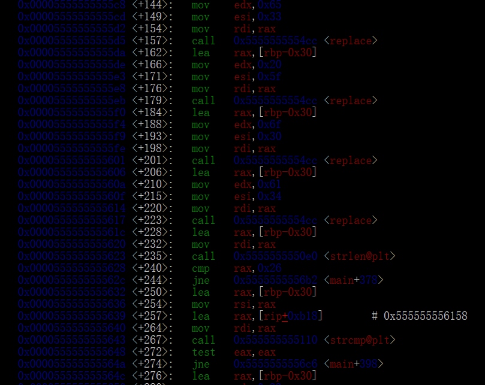
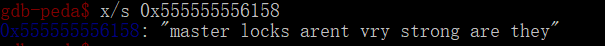

# 题目描述

I forgot the combination to my pad lock :(

# 解决方案

下载附件的程序后，首先gdb反编译一波，直接可以看到重点：

首先目标值的位置在0x555555556158处，查看该处的字符：

从汇编中可以看到有四个replace函数，比如第一个是将0x33替换成0x65，反过来就是0x65替换成0x33，最后得到输入为m4st3r_l0cks_4r3nt_vry_str0ng_4r3_th3y，输入直接拿到flag，其为：

flag{264cec034faef71c642de1721ea26b1f}