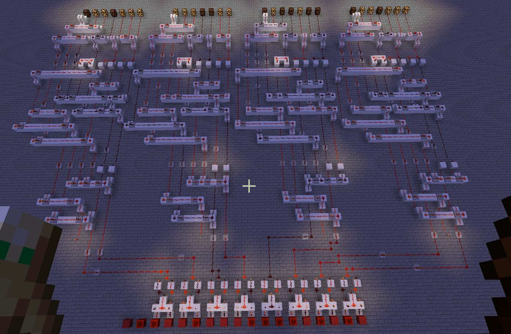

# Description

On his way to buy a new RTX as a Christmas gift Gimi had an altercation with the ender dragon and had to spend a substantial amount of money on (duped) notch apples. Fortunately, he stumbled upon an IT enthusiast who offered him a discount voucher in exchange for homework help. In a hurry, Gimi outsources the job to you in exchange for a flag. Help them, save the day!

This challenge requires you to download and install Minecraft 1.12.2 along with the latest forge. The zip file contains a partial Minecraft installation with a map and the custom npcs mod. You have to open the map and use the item in the chest to analyze the code.

# Solution

改题目需要下载我的世界1.12.2版本，然后再安装对应版本的forge最新版，然后将附件中的文件放入.minecraft目录下，打开游戏，然后进入附件中的存档，里边可以看到一段脚本，对应该目录下的[script](solution/script)，其中个人测试部分是我用来测试地图中的红石电路的，其它部分是本来存在的代码，我们需要对其进行逆向，得到正确的flag。

游戏中关键部分的截图如下所示：

分析发现，一共有16个输入，每个输入要么为redstone，要么为wool，这些输入每两个组成一组，每一组对应的两个输入分两种情况，如果两个输入一样，则该条线路不通，如果两个输入不一样，则该条线路通，一共8条线，每两条线又组成一组，一共4组；然后有28个输出，每个输出对应地图上的红石灯，红石灯要么亮要么不亮，这些输出7个一组，一共4组；每一组输入正好决定每一组输出的状态，输出的状态又决定了输出的字符，当输入正确的flag时，输出的字符正好为GACGCCTGACCCTTATATGGCGTATCCTTGAGCGGCCCCTAAGATCCCTCAGGGGTTTACGCGGAGACCTCTCAAAGGGTGGTGGCCCCTCAGCGAAGATCGAGTGGCAGCTGTCATGACGATTCATAGGATCCAGACTAGGCCATGA。

红石电路状态推导的结果参考[status](solution/status)，成功拿到flag的脚本为该目录下的[solve.py](solution/solve.py)，最后拿到的flag为X-MAS{h4rdWar3_encrypt1on_laNGuagE}。